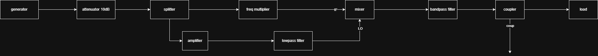

# Draw.io RF Diagram

A small utility that calculates power levels for a correctly formatted Draw.io block diagram and annotates the diagram with the computed values.

---

## Example

Below is a simplified example of how the tool works.

### Input diagram

The diagram blocks and their parameters are defined in [`db/example.json`](db/example.json):



### Computed diagram

After running the script, the computed power and frequency values are automatically added to the diagram:


---

## Installation

Clone the repository and install it from the project root:

```bash
git clone https://github.com/David-Daminelli/Drawio-RF-Diagram.git
cd drawrio-rf
pip install -e .
```

This installs the package locally in editable mode.

---

## Component database

Create a JSON file in the `db/` folder. Each component entry should include at least:

- Component name (pn)
- Required ports
- Gain (or loss) values for each port
- Any other relevant metadata used by your diagram processing

Follow the example provided in the `db/` folder (`db/example.json`).

By default, **all JSON files in the `db/` directory are automatically loaded**.  
If you want to use a specific JSON set, you can pass it explicitly to the Python function, e.g.:

```python
drawio_rf.compute_drawio(file, json=components)
```

---

## Usage

### 1) From Python

```python
import drawio_rf

file = "example.xml"

# Compute power values and return as a pandas DataFrame
circuit_df = drawio_rf.compute_drawio(file)
```

### 2) From the terminal

Run interactively (opens file dialog if no file specified):

```bash
drawio-rf
```

Run with a file path:

```bash
drawio-rf path/to/example.xml
```

---

## What it does

- Parses a Draw.io `.xml` diagram that follows the expected component/port conventions.
- Computes power levels through the network using component data from your JSON database.
- Modifies the original Draw.io XML to add calculated power values as labels on relevant shapes.

---

## Notes

- Ensure your Draw.io blocks and connectors follow the project's expected naming/port conventions for accurate parsing.
- For troubleshooting, enable logging or inspect the output DataFrame returned by `compute_drawio`.

---

## JSON format and block configuration

Each block used in the diagram **must have a corresponding entry** in the JSON database, with the **same name** used in Draw.io.

You can find a full example structure in [`db/example.json`](db/example.json). Below is an overview of how to define each field.

### Field descriptions

#### `ports`
Defines the number and labels of input and output ports.  
It is possible to assign labels to each port using a list, e.g.:

```json
"ports": {"in": [2, ["LO", "IF"]], "out": [1, ["RF"]]}
```

#### `set_power` / `set_frequency`
Initial power and frequency values applied to each port.  
They can be single values or ranges `[min, max]`.  
If a range is provided, it will be displayed as such in the diagram.

#### `gain_power` / `gain_frequency`
Define the gain (or loss) between specific ports.  
The format is `"input-output"`, using port labels.  
For example:
- `"in-out"` applies to all outputs named `out_#`.
- `"in-coup"` applies to a labeled output port named `coup`.

You can also specify frequency-dependent or functional relationships for `gain_frequency`.  
Example:
```json
"gain_frequency": {"IF-LO-RF": ["mixer", 0]}
```

#### `min` / `max`
Define allowed power ranges for each port.  
If computed values exceed these limits, the label will appear **in red** in the diagram.  
Labels must match the port names exactly.

### `cable` component

By adding a component called `cable` to the library, the module will compute its gain to all connections. Nothing will be done if there is no component called `cable`.

#### Units
All **power** and **gain** values are expressed in **dB / dBm**.
