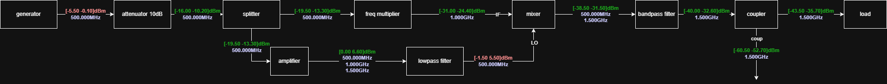

# Draw.io RF Diagram

A small utility that calculates power levels for a correctly formatted Draw.io block diagram and annotates the diagram with the computed values.

---

## Example

Below is a simplified example of how the tool works.

### Input diagram

The diagram blocks and their parameters are defined in [`db/example.json`](db/example.json):


### Computed diagram

After running the script, the computed power and frequency values are automatically added to the diagram:



## Installation

Clone the repository and install it from the project root:

```bash
git clone https://github.com/David-Daminelli/Drawio-RF-Diagram.git
cd drawrio-rf
pip install -e .
```

This installs the package locally in editable mode.

---

## Component database

Create a JSON file in the `db/` folder. Each component entry should include at least:

- Component name (pn)
- Required ports
- Gain (or loss) values for each port
- Any other relevant metadata used by your diagram processing

Follow the example provided in the `db/` folder.

---

## Usage

### 1) From Python

```python
import drawio_rf

file = "example.xml"

# Compute power values and return as a pandas DataFrame
circuit_df = drawio_rf.compute_drawio(file)
```

### 2) From the terminal

Run interactively (opens file dialog if no file specified):

```bash
drawio-rf
```

Run with a file path:

```bash
drawio-rf path/to/example.xml
```

---

## What it does

- Parses a Draw.io `.xml` diagram that follows the expected component/port conventions.
- Computes power levels through the network using component data from your JSON database.
- Modifies the original Draw.io XML to add calculated power values as labels on relevant shapes.
---

## Notes

- Ensure your Draw.io blocks and connectors follow the project's expected naming/port conventions for accurate parsing.
- For troubleshooting, enable logging or inspect the output DataFrame returned by `compute_drawio`.